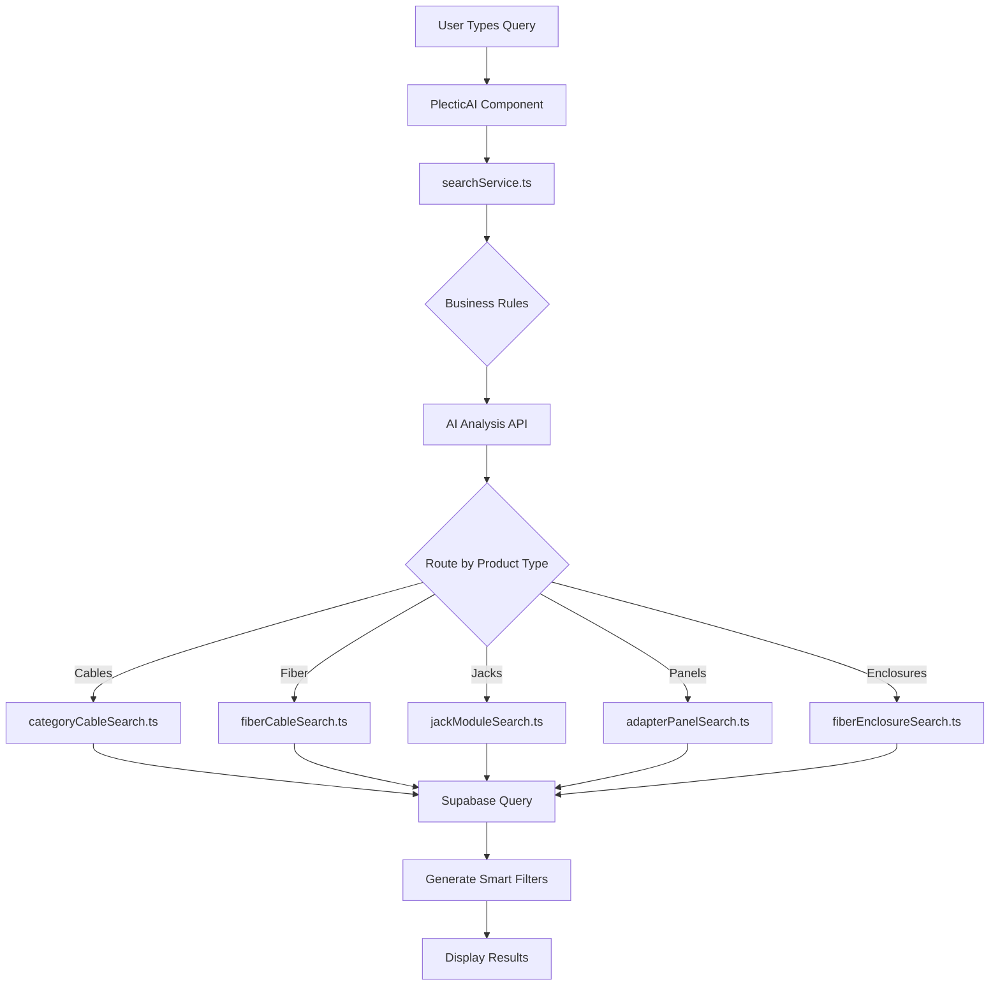

# How Plectic AI Search Works - A Step-by-Step Guide

This guide walks through exactly what happens when you search for electrical products, using 5 real examples. We'll trace each search from start to finish, showing which files are involved and how AI enhances the process.

## 🏗️ Application Architecture Overview

```
User Interface (PlecticAI.tsx)
    ↓
Search Service (searchService.ts)
    ↓
AI Analysis (ai-search/route.js)
    ↓
Product-Specific Search (search/[product]/Search.ts)
    ↓
Database Query (Supabase)
    ↓
Results with Smart Filters
```

---

## 🔍 Search Example 1: "I need 20,000 ft of Cat5e Blue Cable"

### Step 1: User Types in Search Box
**File**: `components/PlecticAI.tsx` (lines 890-895)
```typescript
<input
  type="text"
  value={currentMessage}
  onChange={(e) => setCurrentMessage(e.target.value)}
  placeholder="Search for electrical products..."
/>
```
- User types: "I need 20,000 ft of Cat5e Blue Cable"
- The `currentMessage` state updates with each keystroke

### Step 2: User Hits Enter or Clicks Search
**File**: `components/PlecticAI.tsx` (lines 760-780)
```typescript
const handleSendMessage = async () => {
  const trimmedMessage = currentMessage.trim()
  if (!trimmedMessage) return

  // Add user message to chat
  setMessages(prev => [...prev, {
    id: Date.now().toString(),
    role: 'user',
    content: trimmedMessage
  }])
  
  // Call search service
  const results = await searchProducts(trimmedMessage)
}
```

### Step 3: Search Service Orchestrates the Process
**File**: `services/searchService.ts` (lines 220-250)
```typescript
export async function searchProducts(searchTerm: string): Promise<SearchResult> {
  // 1. Validate the query
  const validation = validateElectricalQuery(searchTerm)
  
  // 2. Apply business rules (Cat5 → Cat5e)
  const businessRuleResult = applyBusinessRules(searchTerm)
  // "Cat5e" stays as "Cat5e"
  
  // 3. Check for part numbers
  const detectedParts = detectPartNumbers(searchTerm)
  // No part numbers found in this query
  
  // 4. Send to AI for analysis
  const aiAnalysis = await analyzeSearchWithAI(searchTerm)
}
```

### Step 4: AI Analyzes the Natural Language
**File**: `app/api/ai-search/route.js` (lines 70-130)
```javascript
// AI receives: "I need 20,000 ft of Cat5e Blue Cable"
// AI prompt asks it to identify:
// - Product type (cable, connector, panel, etc.)
// - Specifications (color, rating, quantity)

// AI returns:
{
  "searchStrategy": "cables",
  "productType": "CABLE",
  "confidence": 0.95,
  "detectedSpecs": {
    "categoryRating": "CAT5E",
    "color": "BLUE",
    "requestedQuantity": 20000,
    "jacketRating": null
  },
  "searchTerms": ["cat5e", "blue", "cable"],
  "reasoning": "User needs Cat5e ethernet cable in blue color"
}
```

**🤖 AI Enhancement**: The AI understands that "I need" is just context, extracts "20,000" as quantity, recognizes "Cat5e" as a cable category, and "Blue" as a color specification.

### Step 5: Route to Category Cable Search
**File**: `services/searchService.ts` (lines 500-520)
```typescript
// Based on AI's productType: "CABLE", route to category cable search
if (productType === 'CABLE' && !searchTerm.includes('fiber')) {
  return await searchCategoryCables({
    searchTerm: processedTerm,
    aiAnalysis,
    limit: options.limit
  })
}
```

### Step 6: Category Cable Search Executes
**File**: `search/categoryCables/categoryCableSearch.ts` (lines 150-200)
```typescript
async function searchCategoryCables() {
  // Build query
  let query = supabase
    .from('category_cables')
    .select('*')
    .eq('is_active', true)
  
  // AI said CAT5E, so filter by that
  if (detectedSpecs.categoryRating === 'CAT5E') {
    query = query.eq('category_rating', 'Cat5e')
  }
  
  // AI said BLUE, so filter by that
  if (detectedSpecs.color === 'BLUE') {
    query = query.eq('color', 'Blue')
  }
  
  // Execute query
  const { data: products } = await query
}
```

### Step 7: Generate Smart Filters
**File**: `search/categoryCables/categoryCableSearch.ts` (lines 300-350)
```typescript
function generateFilters(products) {
  return {
    brands: [...new Set(products.map(p => p.brand))],
    colors: [...new Set(products.map(p => p.color))],
    jacketRatings: [...new Set(products.map(p => p.jacket_rating))],
    categoryRatings: [...new Set(products.map(p => p.category_rating))]
  }
}
// Returns: brands: ["Commscope", "Panduit"], colors: ["Blue"], etc.
```

### Step 8: Results Displayed
**File**: `components/PlecticAI.tsx` (lines 950-1000)
- Shows matching blue Cat5e cables
- Displays smart filters for refinement
- Shows the detected quantity of 20,000 ft
- Each product shows stock status (green/yellow/red)

---

## 🔍 Search Example 2: "I need 4RU fiber enclosure"

### Steps 1-3: Same as above

### Step 4: AI Analysis
**File**: `app/api/ai-search/route.js`
```javascript
// AI receives: "I need 4RU fiber enclosure"
// AI returns:
{
  "searchStrategy": "enclosures",
  "productType": "ENCLOSURE",
  "confidence": 0.98,
  "detectedSpecs": {
    "rackUnits": 4,
    "mountType": "rack"
  },
  "reasoning": "4RU indicates 4 rack units, fiber enclosure"
}
```

**🤖 AI Enhancement**: The AI recognizes "4RU" as 4 rack units (not "4RU" as text), and knows this is a rack-mount enclosure, not wall-mount.

### Step 5: Route to Fiber Enclosure Search
**File**: `services/searchService.ts`
```typescript
if (productType === 'ENCLOSURE') {
  return await searchFiberEnclosures({
    searchTerm: processedTerm,
    aiAnalysis,
    limit: options.limit
  })
}
```

### Step 6: Fiber Enclosure Search
**File**: `search/fiberenclosure/rack_mount_fiber_enclosure_Search.ts`
```typescript
// Since AI detected rack mount and 4 rack units:
let query = supabase
  .from('rack_mount_fiber_enclosures')
  .select('*')
  .eq('is_active', true)
  .eq('rack_units', 4)  // AI detected 4RU
```

---

## 🔍 Search Example 3: "fiber optic adapter panel"

### Step 4: AI Analysis
```javascript
// AI returns:
{
  "searchStrategy": "panels",
  "productType": "PANEL",
  "confidence": 0.92,
  "detectedSpecs": {
    "fiberType": null,
    "connectorType": null
  },
  "reasoning": "Generic fiber adapter panel request"
}
```

**🤖 AI Enhancement**: The AI understands this is an adapter panel (not cable or connectors), even without specific fiber type.

### Step 6: Adapter Panel Search
**File**: `search/fiberadapterPanels/fiberadapterPanelSearch.ts`
```typescript
// Since no specific type mentioned, search all adapter panels
let query = supabase
  .from('adapter_panels')
  .select('*')
  .eq('is_active', true)
  
// No specific filters applied - will return all types
// Smart filters will show: LC, SC, ST options
```

---

## 🔍 Search Example 4: "I need 2000 ft of fiber optic cable"

### Step 4: AI Analysis
```javascript
// AI returns:
{
  "searchStrategy": "cables",
  "productType": "CABLE",
  "confidence": 0.90,
  "detectedSpecs": {
    "fiberType": null,  // Not specified
    "requestedQuantity": 2000,
    "length": 2000
  },
  "reasoning": "Fiber cable request without specific type"
}
```

**🤖 AI Enhancement**: The AI knows this is fiber cable (not ethernet), extracts quantity, but notes no specific fiber type (OM3, OM4, OS2, etc.).

### Step 6: Fiber Cable Search
**File**: `search/fiberCables/fiberCableSearch.ts`
```typescript
// Will search fiber_cables table
// Since no type specified, returns all types
// Results will include OM3, OM4, OS2 cables
// Smart filters let user narrow down
```

### Special Feature: Fiber Type Reference
**File**: `components/PlecticAI.tsx` (lines 39-68)
```typescript
// When fiber products are shown, displays helpful guide:
<FiberTypeReference />
// Shows:
// - OM3: Good multimode, 300m at 10Gb
// - OM4: Best multimode, 550m at 10Gb  
// - OS2: Best overall, 5000m+ at 10Gb
```

---

## 🔍 Search Example 5: "I need 10 Cat 6 Jacks"

### Step 4: AI Analysis - Critical Decision Point
**File**: `app/api/ai-search/route.js` (lines 50-75)
```javascript
// AI trained to recognize "jack" keywords
// Special rules for jack detection:
if (query.includes('jack') || query.includes('keystone')) {
  return {
    "searchStrategy": "jack_modules",
    "productType": "JACK_MODULE",
    "detectedSpecs": {
      "categoryRating": "CAT6",
      "requestedQuantity": 10
    }
  }
}
```

**🤖 AI Enhancement**: The AI distinguishes between "Cat6 cable" and "Cat6 jack" - completely different products in different database tables.

### Step 6: Jack Module Search
**File**: `search/jackModules/jackModuleSearch.ts`
```typescript
let query = supabase
  .from('jack_modules')  // Different table!
  .select('*')
  .eq('is_active', true)
  .eq('category_rating', 'Cat6')
  
// Returns keystone jacks, not cables
```

---

## 🧠 How AI Makes Decisions

### 1. **Product Type Detection**
The AI is trained with rules like:
- "cable" + "cat5/6" → Category cables
- "cable" + "fiber" → Fiber cables  
- "jack"/"keystone" → Jack modules
- "RU"/"rack unit" → Rack mount enclosures
- "connector" + "LC/SC" → Fiber connectors

### 2. **Specification Extraction**
The AI extracts:
- **Quantities**: "10", "2000 ft", "20,000"
- **Colors**: "blue", "aqua", "yellow"
- **Ratings**: "Cat5e", "OM4", "plenum"
- **Sizes**: "4RU", "12 strand", "24 port"

### 3. **Context Understanding**
The AI ignores filler words:
- "I need" → Ignored
- "Looking for" → Ignored  
- "Show me" → Ignored
- Focuses on actual product specs

---

## 📊 Complete Data Flow



---

## 🔑 Key Files Summary

1. **`components/PlecticAI.tsx`** - User interface, displays results
2. **`services/searchService.ts`** - Main orchestrator, routes searches
3. **`app/api/ai-search/route.js`** - AI analysis endpoint
4. **`search/[product]/[product]Search.ts`** - Product-specific search logic
5. **`lib/supabase.ts`** - Database connection
6. **`types/*.ts`** - TypeScript type definitions

---

## 💡 Why This Architecture?

1. **Separation of Concerns**: Each file has one job
2. **AI Enhancement**: Natural language → structured queries
3. **Flexibility**: Easy to add new product types
4. **Performance**: Caches AI responses, efficient queries
5. **User Experience**: Smart filters, helpful guides

---

## 🚀 Adding a New Product Type

To add a new product type (e.g., "circuit breakers"):

1. Create `search/circuitBreakers/circuitBreakerSearch.ts`
2. Add to AI training in `ai-search/route.js`
3. Add routing logic in `searchService.ts`
4. Create database table in Supabase
5. Add TypeScript types

The modular architecture makes expansion straightforward!

---

## 📚 Learning Resources

- **Next.js**: React framework for the UI
- **TypeScript**: Adds types to JavaScript
- **Supabase**: PostgreSQL database + API
- **OpenAI**: Natural language processing
- **Tailwind CSS**: Utility-first styling

This architecture balances simplicity with power, making it easy to maintain while providing sophisticated search capabilities.